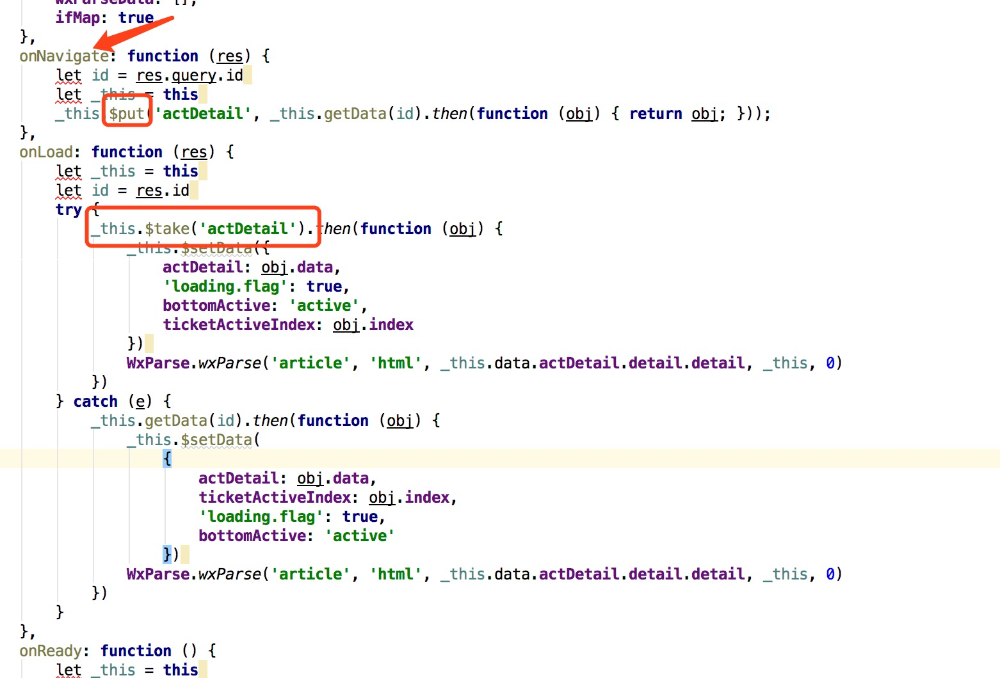
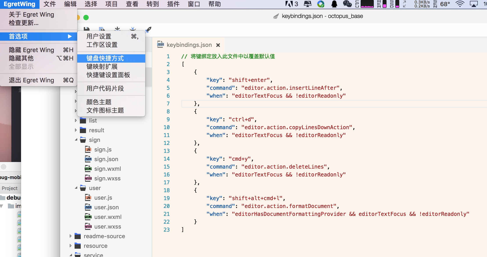
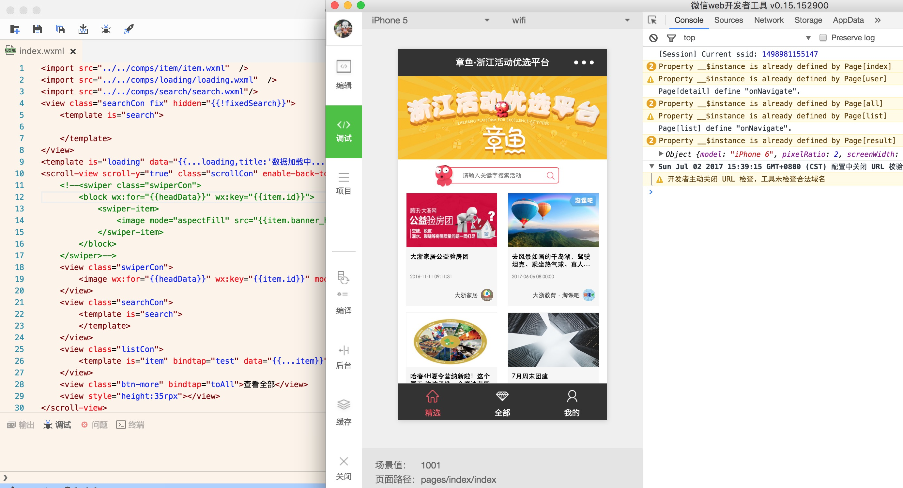
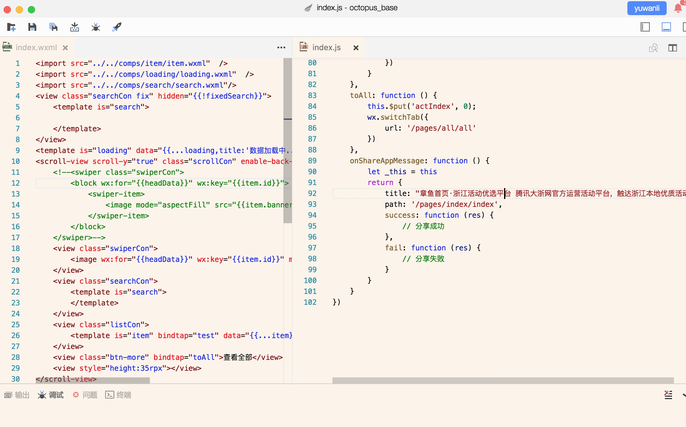
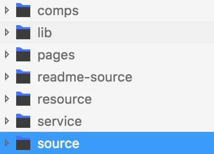
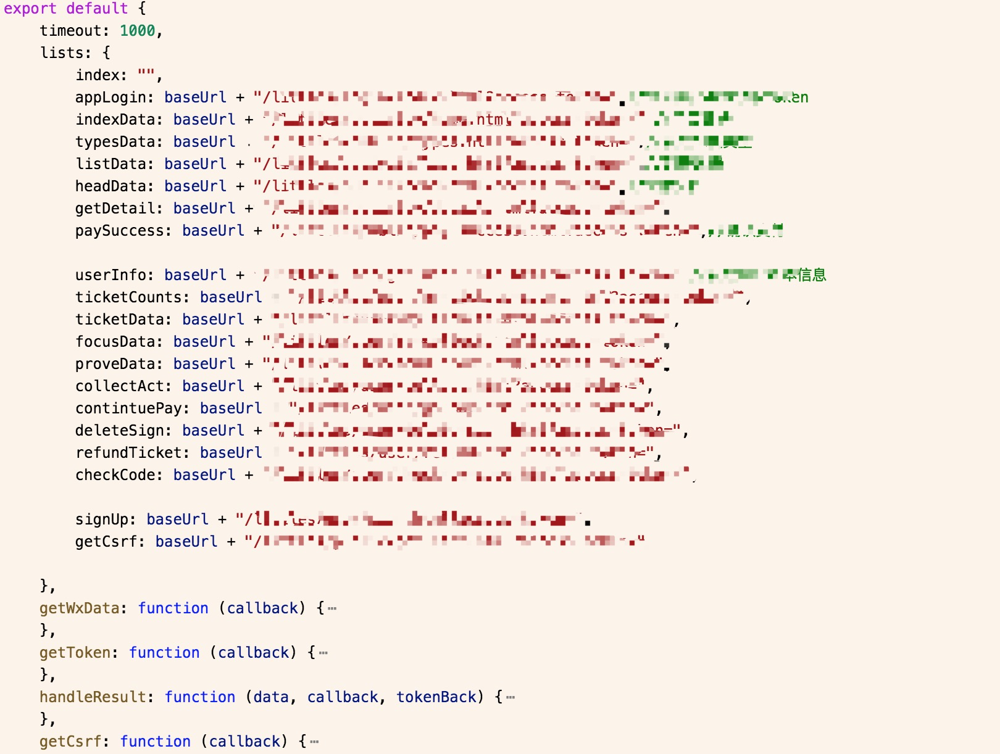
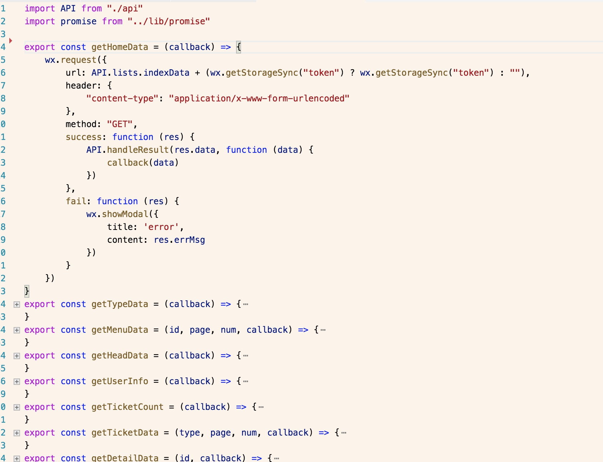

章鱼活动平台 小程序
==========================

章鱼活动平台，浙江本地活动的优选平台。

章鱼平台包含的功能很多，包括活动的创建与发布、优质的活动的筛选、活动的报名与审核、自定义门票、线下扫码签到等一系列功能。

本人主要负责章鱼活动[pc端用户主页部分](https://github.com/yuwanli/zhangyu-pc)、小程序的开发及后期的h5版的迭代与升级。

这里主要是介绍章鱼小程序开发的总结与一些心得，希望能与大家分享（很想把源码推上来的，由于是公司项目，有保密协议没法直接推上来，对源码有兴趣或者有需要可留言私密我）。

### 项目基础框架选型  [wxpage](https://github.com/tvfe/wxpage)
>WXPage 是一个极其轻量的微信小程序开发框架，其中的API蕴含了“极致页面打开速度的思想”，为可维护性与开发效率而设计的功能，框架来自“腾讯视频”小程序的项目沉淀。

wxpage是在2016年年底去上海参加微信小程序的公开课的时候了解到的，当时就对作者封装的onNavigate还是有onPreload特别感兴趣，本人毕竟只是前端菜鸟，所以作者的那些开发理念和做法确实是挺颠覆我的，值得学习和借鉴的地方有很多，所以这里墙裂推荐大家使用。

用作者的说法是，用这种方式可以做到'零秒打开页面'，无空白等待的情况，这里大致分析一下：

小程序不同于h5的重要一点是，小程序的js是运行在JSCore(安卓x5内核)中的，所以这也是小程序可以原生媲美的原因之一，也是小程序之所以能称为"应用"的原因之一。这样就导致用户打开应用的时候，所有的页面的其实是算启动了，这个时候页面之前是可以进行通信的。（不知道这么解释正不正确啊，毕竟还是菜鸟，希望有大牛帮忙补充）

所以可以做的就是提前加载，上一个页面加载下一个页面的数据，然后保存起来，下一个页面先去取，能取到就无须再去请求，若没取到（网络原因或其他原因导致没存储进来），则请求数据即可。

拿我开发的这个小程序来说，列表页点击进入详情是一个常见的情况：

1，用户点击的时候去请求数据（这个时候还没跳转到详情），这个时候会触发目标页面的onNavigate（扩展的生命周期），此时对应的叶页面并未被加载，这个时候去请求数据然后通过$put，存储起来

2，页面onLoad的时候先去$take数据，若没取到则再去请求数据

当然，wxpage不仅仅只有这些，它还有对页面、组件的扩展，还有页面生命周期的扩展、自定义的函数属性等等，大家可以参考wxpage的git主页，有兴趣也可以去读下源码。

### [项目的开发工具](https://www.egret.com/products/wing.html)
可以先吐槽下微信官方提供的小程序开发者工具，当然现在大家看到的开发者工具算好很多，但是还是有很多有缺陷的地方，可是我是在小程序内测阶段的时候就开始玩小程序了，那更不用说内测阶段时候的开发者工具了。当然，吐槽归吐槽，作为开发者要有一个包容的心，毕竟他们在不断的完善开发者工具，总是会越来越好。

这里，给大家介绍一款方便开发小程序的工具，不是说这个工具有多好，只能说能方便大家的开发。

这个是白鹭时代（egret） 下面的一款产品（wing），去网站看你会发现这个主要是游戏编辑器，但是也支持小程序的开发。不得不说白鹭时代，很了不起，有一系列优秀的产品，有一套游戏开发的解决方案，主要是国产的，对！国产的！虽然并不是专业的游戏开发者，但是对他们的产品有些些了解，也参加过他们组织的小程序分享会，觉得还是很腻害的一家公司。

为何选择使用wing:

1，可自定义快捷键，这是件很酷的事情，想想就很酷；

2，配合官方的开发者工具一起使用，最好是分屏，wing负责代码的编辑，官方开发者工具负责看效果和调试，这样就无须在开发者工具中来回切换。

3，可以像很多编辑器那样split

以上三点就可以让你像平时开发h5一样开发小程序，大家可以先试着用下开发者工具，大概就能了解我说的那些痛了。

### 项目的管理

comps:顾名思义，components组件。我会把项目中通用的部分模块化，组件化，如通用底部、loading、章鱼形象、搜索框、门票、列表等。

libs:用到的一些库

 * [wxParse](https://github.com/icindy/wxParse):用于富文本解析。小程序不支持html里面的标签，所以这里需要对富文本的内容进行解析，生成能运行在小程序里的代码。感谢这样的人民工程师，不然富文本解析这个让我一个菜鸟来解决的话，估计得哭晕在厕所吧。(记得没错的话，这个的作者是白鹭时代的开发)

 * promise:小程序支持es6的大部分语法，起初是支持promise的，忘了是因为啥后来不支持，所以这里得手动引入promise。

 * [wxqrcode](https://kazuhikoarase.github.io/qrcode-generator/):因项目需要把一串码生成一个二维码用户线下扫码。

 * wxpage:前面说的项目基础框架

pages:项目所涉及到的页面

resource:用户放设计稿及项目相关文档，便于项目开发。

service:个人的习惯，把所有的接口放在一个api.js文件进行管理，这里还把自定义的公用函数放在里面，然后还会有一个文件，里面放的是项目的所有接口请求，所有的成功通过回调的方式暴露出来。

source:存放静态资源

### 关于tab切换

tab切换：很普通的需求，点击tab切换，下面的列表数据切换成对应的数据，如下图

 可扫下面码体验：

 

可能大部分能想到的就是和这位前端想到的处理方式一样吧，切换就切换，无非是换个标签，切换一个tab，page从就1重新开始。可是如果用户反复的来回切换呢？之前请求的数据再请求一遍？第一个tab已经请求了第三个page了，然后切换到第二个，然后再切换回来呢，滚动条的位置这么办？

我的做法是这样的：

每一个标签对应一个对象，对象包含的数据有page、scrollTop、ifMore、active等属于当前标签的字段

*active:标志当前标签是否被选中，标志位（用于区分标签选中前后样式）

*ifMore:列表请求回数据时，若长度小于默认的pageNum，则可判断无很多数据，标志位，用于显示'无更多数据'，及减少无必要的请求

*scrollTop:添加一个scrollListen事件，记录各自移动的位置，切换时直接定位到上次浏览的位置，提示用户体验

*page:存该标签当前所处的page，避免重置成1，重复请求

对应的效果，大家可以进入小程序体验下，对应着h5，可以看出明显的差别。

### 项目总结

此次小程序的开发，独立完成，且审核一次通过，算是比较成功的吧。后来想了想原因，应该是项目初期对于框架的选择和项目结构的搭建及细节的把握都做了比较足的工作，这让我想起以前写作文的时候，老师总让我们先列提纲，我觉得拿到我们项目的开发中也是有道理的。先收集各种相关资料，选定框架、理清自己的项目结构、项目中可能的难点、可优化的地方等等，总之不是上来就开始写代码。此次开发，对我成长有很大的帮助。